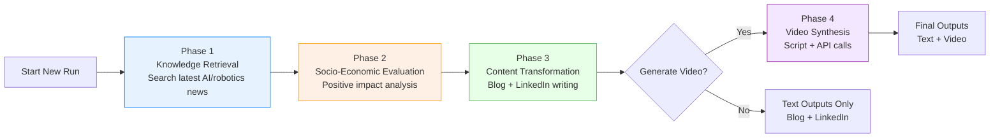
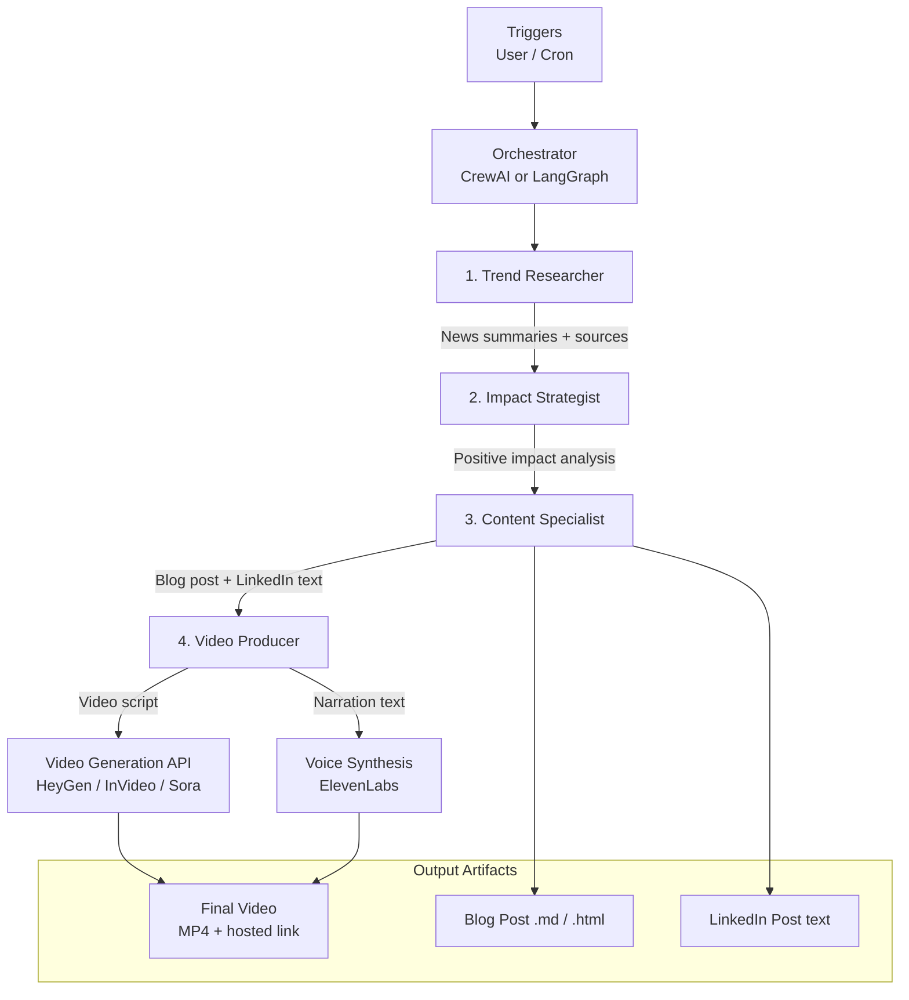

# News to Video AI Agent

**AI Agentic Application that transforms latest AI & Robotics news into educational blog posts, LinkedIn content, and positive, accessible videos for non-technical audiences.**

Created: December 30, 2025  
Status: Conceptual / Early Planning

## 🎯 Project Goal

This application automatically:

1. Finds the latest credible news about **AI and robotics advancements**
2. Evaluates realistic, balanced impact on **daily life**, **jobs**, and the **long-term future**
3. Converts insights into **high-quality text content** (blog articles + LinkedIn posts)
4. Produces **short, positive, human-centric videos** explaining the news in plain language
5. Ensures all output is **educational, enriching, optimistic**, and avoids fear-mongering

Target audience: non-technical people who want to stay informed without being overwhelmed by jargon or doom narratives.

## 📋 Core Requirements

- **Input focus**: Latest trends & breakthroughs in AI and robotics
- **Analysis**: How it affects everyday life, employment landscape, and future society
- **Text output**:
  - ~800-word educational blog post
  - Professional LinkedIn post (Hook → Value → CTA format)
- **Video output**:
  - 2–4 minute video in plain English
  - Positive tone, inspiring visuals, uplifting background music
  - Ends with actionable “What you can do today” segment
- **Tone guardrails**: Always pivot negatives → opportunities; emphasize human creativity, new roles, accessibility

## 🏗️ Architecture Overview

Multi-agent system built with **CrewAI** or **LangGraph**.

Four specialized agents collaborate in sequence:

| Agent                | Role                        | Main Responsibility                              | Key Tools / LLM Calls                  |
|----------------------|-----------------------------|--------------------------------------------------|----------------------------------------|
| Trend Researcher     | Scraper & Analyst           | Find + filter latest credible AI/robotics news   | Tavily / Serper.dev                    |
| Impact Strategist    | Evaluation Engine           | Analyze socio-economic impact (positive lens)    | Gemini 1.5 Pro / GPT-4o reasoning      |
| Content Specialist   | Copywriter                  | Write blog post + LinkedIn content               | Long-context writing                   |
| Video Producer       | Script & Visual Logic       | Create video script + call video generation API  | HeyGen / InVideo AI / Sora + ElevenLabs|

### System Layers

1. **Input Layer**            – Triggers, user queries, scheduling  
2. **Orchestration Layer**    – CrewAI / LangGraph (agent coordination, memory, retries)  
3. **Agent Processing Layer** – The 4 core agents  
4. **Tool / Integration Layer** – Search, LLM, Video & Voice APIs  
5. **Output Layer**           – Markdown/HTML posts + MP4 video files  
6. **Guardrails Layer**       – Positivity enforcement, sentiment checks

### Workflow

### High-Level Architecture Diagram (Mermaid)


### 🛠️ Technology Stack
  | Layer              | Recommended First                          | Alternatives                     |
|--------------------|--------------------------------------------|----------------------------------|
| Orchestration      | CrewAI                                     | LangGraph, AutoGen               |
| Core LLM           | Gemini 1.5 Pro                             | GPT-4o, Claude 3.5 Sonnet        |
| Web Search         | Tavily                                     | Serper.dev, Google News API      |
| Video Generation   | HeyGen (avatar + b-roll)                   | InVideo AI, Runway Gen-3, Sora   |
| Voice / Narration  | ElevenLabs (natural, positive voices)      | PlayHT, Google WaveNet           |
| Storage / Cache    | SQLite / JSON files                        | MongoDB, Redis                   |
| Deployment         | Docker + FastAPI / Streamlit               | Vercel, Railway, AWS Lambda      |


## High-Level Implementation Plan – Web Search Layer (using Tavily)

This layer is primarily used by the **Trend Researcher** agent to fetch the latest credible news and trends about AI and robotics advancements.

### 1. Setup and Authentication

- Sign up for a Tavily account at [https://tavily.com](https://tavily.com)
- Generate an API key (free tier gives 1,000 credits/month – no credit card required initially)
- Store the API key securely:
  - `.env` file (for local development)
  - Environment variables (Docker, Railway, Vercel, GitHub Secrets, etc.)
  - Example: `TAVILY_API_KEY=tvly-XXXXXXXXXXXXXXXXXXXXXXXX`

### 2. Environment Preparation

- Language: Python 3.10+
- Install the official SDK:

```bash
pip install tavily-python
```

### 3. Core Integration – Tavily Client Initialization
```bash
from tavily import TavilyClient
from dotenv import load_dotenv
import os

load_dotenv()

tavily = TavilyClient(api_key=os.getenv("TAVILY_API_KEY"))
```
### 4. Query Design Guidelines
Use structured, high-precision queries to get clean, relevant results:
```bash
queries = [
    "latest humanoid robotics breakthroughs 2025",
    "AI advancements this week site:techcrunch.com OR site:mit.edu OR site:wired.com OR site:theverge.com",
    "new generative AI models December 2025",
    "robotics applications in healthcare OR elderly care 2025",
]
```
Tavily search parameters:
```bash
search_params = {
    "search_depth": "advanced",       # or "basic" for faster/cheaper
    "max_results": 8,                 # 5–10 is usually optimal
    "include_answer": True,           # gives a quick summarized answer
    "include_raw_content": False,     # usually not needed – saves tokens
    "include_images": False,          # enable only if needed for video producer
    "include_domains": ["techcrunch.com", "mit.edu", "wired.com", "theverge.com", "nature.com"],
    "exclude_domains": ["reddit.com", "youtube.com", "tiktok.com", "facebook.com"]
}
```
### Error Handling & Fallback Strategy
```mermaid
┌───────────────────────┐
│ Tavily call           │
└───────────┬───────────┘
            │
     ┌──────┴──────┐
     │   Success?   │
     └──────┬──────┘
       Yes  │   No
   ┌────────┘     └───────┐
   ▼                      ▼
┌──────────────┐     ┌───────────────────┐
│ Return clean │     │ Log error         │
│ structured   │     │ Try Serper.dev    │
│ results      │     │ (fallback)        │
└──────────────┘     └───────────────────┘
```
### Monitoring & Cost Control 
Track usage in Tavily dashboard (credits consumed per query)
Free tier: 1,000 credits/month (~200–400 advanced searches)
Set alerts when approaching 80% of quota
Implement query caching (SQLite / Redis) for repeated topics
Use search_depth="basic" for initial filtering passes
